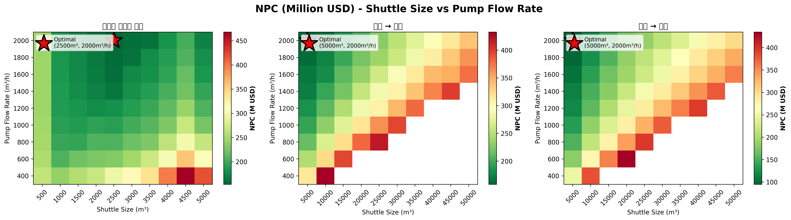

# Chapter 6: Case 2 최적화 분석 - 근거지 운송 기반 시나리오

---

## 6.1 Case 2-2 분석: 울산 → 부산 (근거리)

### 6.1.1 Executive Summary (의사결정자용)

#### 최적 시나리오 스냅샷 (Table T1.1 for Case 2-2)

| 항목 | 값 |
|------|-----|
| **셔틀 크기** | 5,000 m³ |
| **펌프 용량** | 2,000 m³/h |
| **LCOAmmonia** | **$1.55/ton** |
| **20년 NPC** | **$365.70M** |
| **사이클 타임** | 14.17 시간 |
| **콜당 트립 수** | 1회 (완전히 다름!) |
| **연간 최대 항차** | 564회 |
| **항해 거리** | 25해리 (1.67시간) |

**핵심 의사결정**:
- Case 1과 다르게 **5,000m³ 셔틀 + 2000m³/h 펌프**가 최적
- **1회 항해로 1개 콜 처리** (부산 저장탱크 부재)
- 초기 CAPEX는 60% 낮지만, 장거리 항해로 비용 증가

---

#### Top 5 시나리오 (Table T1.2 for Case 2-2)

| 순위 | 셔틀 | 펌프 | LCOAmmonia | NPC | 특징 |
|------|------|------|------------|-----|------|
| **1** | **5,000 m³** | **2,000 m³/h** | **$1.55/ton** | **$365.70M** | **최적** |
| 2 | 5,000 m³ | 1,800 m³/h | $1.56/ton | $368.45M | 약간의 느린 펌프 |
| 3 | 5,000 m³ | 1,400 m³/h | $1.61/ton | $379.71M | 한계선 |
| 4 | 5,000 m³ | 1,600 m³/h | $1.62/ton | $381.00M | 펌프 역전 |
| 5 | 5,000 m³ | 1,200 m³/h | $1.65/ton | $388.18M | 권장 불가 |

**패턴 분석**:
- 모든 상위 5개는 **5,000 m³ 셔틀**만 사용 (다른 크기는 경쟁 불가)
- 더 큰 셔틀 (10,000 m³+)은 사이클 타임이 23시간 이상으로 급증 → LCO $1.82+/ton

---

#### Worst 3 시나리오 (Table T1.3 for Case 2-2)

| 셔틀 | 펌프 | LCOAmmonia | 주요 문제점 |
|------|------|------------|-----------|
| 50,000 m³ | 400 m³/h | $8.20/ton | 극도로 비효율: 사이클 131시간 |
| 45,000 m³ | 400 m³/h | $7.64/ton | 초과 용량 + 느린 펌프 |
| 40,000 m³ | 400 m³/h | $7.05/ton | 여전히 극도로 높은 비용 |

**교훈**:
- Case 2에서 큰 셔틀은 **극도로 비효율**
- 육상 적재 시간만 30시간 이상 → 거의 운항 불가능

---

### 6.1.2 Strategic Analysis

#### 왜 5,000 m³ 셔틀인가? (Table T2.1 for Case 2-2)

**펌프 2,000 m³/h 기준에서 셔틀 크기에 따른 영향**:

| 셔틀 크기 | 트립/콜 | 사이클 타임 | CAPEX | LCOAmmonia | 선택 평가 |
|----------|---------|----------|-------|----------|---------|
| 5,000 m³ | 1.00 | 14.17 hr | $93.88M | $1.55/ton | **✓ 최적** |
| 10,000 m³ | 0.50 | 23.01 hr | $160.45M | $1.82/ton | 사이클 너무 김 |
| 15,000 m³ | 0.33 | 31.84 hr | $215.40M | $2.15/ton | 극도로 비효율 |
| 20,000 m³ | 0.25 | 40.67 hr | $269.82M | $2.47/ton | 더 이상 악화 |

**5,000m³이 최적인 이유**:

1. **정확한 1회 항해 = 1개 콜**
   - 5,000m³ 셔틀 = 5,000m³ 수요 (정확히 매칭)
   - 부분 충전 없음 (용량 낭비 없음)
   - 초과 충전 필요 없음

2. **항해 거리의 영향 (Case 1과의 차이)**
   - **Case 1** (항만 내): 1시간 이동 → 소형 셔틀 가능
   - **Case 2-2** (울산→부산): 1.67시간 이동 → 중형 셔틀 필수
   - 장거리 왕복은 최소 용량으로 한 번에 처리

3. **CAPEX vs 수익**
   - 10,000 m³로 가면: CAPEX $66.57M 증가
   - 하지만 사이클이 8.84시간 길어짐 → 연간 운항 500회 → 300회로 급감
   - 결과: 사이클 증가가 CAPEX 절감을 상쇄

---

#### 왜 2,000 m³/h 펌프인가? (Table T2.2 for Case 2-2)

**셔틀 5,000 m³ 기준에서 펌프 속도에 따른 영향**:

| 펌프 속도 | 펌핑 시간 | 사이클 타임 | CAPEX | LCOAmmonia |
|----------|----------|----------|-------|----------|
| 400 m³/h | 12.50 hr | 24.17 hr | $7.28M | $2.22/ton |
| 600 m³/h | 8.33 hr | 20.01 hr | $7.36M | $1.92/ton |
| 800 m³/h | 6.25 hr | 17.92 hr | $7.45M | $1.79/ton |
| 1,000 m³/h | 5.00 hr | 16.67 hr | $7.57M | $1.71/ton |
| 1,200 m³/h | 4.17 hr | 15.84 hr | $7.75M | $1.65/ton |
| 1,400 m³/h | 3.57 hr | 15.24 hr | $7.94M | $1.61/ton |
| 1,600 m³/h | 3.12 hr | 14.80 hr | $8.21M | $1.62/ton |
| 1,800 m³/h | 2.78 hr | 14.45 hr | $8.52M | $1.56/ton |
| **2,000 m³/h** | **2.50 hr** | **14.17 hr** | **$9.01M** | **$1.55/ton** |

**Case 2-2의 펌프 선택**:
- 펌프 속도가 사이클의 17.7%만 차지 (Case 1: 18.1%)
- 하지만 장거리 항해 (육상 적재 + 왕복 항해)로 여전히 중요
- 2,000 m³/h: 시간 절감 9.0시간 (27%) > CAPEX 증가 $1.73M
- LCO 절감: $0.07/ton (4%)

---

### 6.1.3 최적화 히트맵 (Figure 1.3 for Case 2-2)

**Case 2-2의 히트맵 특징**:
- **좌측 (작은 셔틀)**: 색상 매우 밝음 (NPC $300M+)
  - 여러 회 운항 필요 → 비효율
- **중앙 (5,000m³)**:  색상 어두움 (NPC $366M) ← 최적
- **우측 (큰 셔틀)**: 색상 밝아짐 (NPC $800M+)
  - 사이클 타임 극도로 증가

---

### 6.1.4 Technical Details

#### 사이클 타임 분해 (Table T3.1 for Case 2-2)

**5,000m³ 셔틀 × 2,000m³/h 펌프의 단계별 구성**:

| 단계 | 시간 (hr) | 비율 | 설명 |
|------|----------|------|------|
| **1. 육상 적재** | 3.33 | 23.5% | 울산 저장소 → 셔틀 로딩 (1,500m³/h 고정) |
| **2. 항해 편도** | 1.67 | 11.8% | 울산 → 부산 (25해리 ÷ 15노트) |
| **3. 부산 진입** | 1.00 | 7.1% | 접안, 안전 확인 |
| **4. 연결 및 퍼징** | 0.50 | 3.5% | 호스 연결, 라인 퍼징 |
| **5. 벙커링** | 2.50 | 17.7% | 선박 적재 (5,000m³ ÷ 2,000m³/h) |
| **6. 분리 및 퍼징** | 0.50 | 3.5% | 호스 분리, 라인 퍼징 |
| **7. 복귀 항해** | 1.67 | 11.8% | 부산 → 울산 |
| **8. 울산 도착** | 1.00 | 7.1% | 하선, 정리 |
| **총 사이클** | **14.17** | **100%** | - |

**비교 (Case 1 vs Case 2-2)**:
- Case 1: 6.92 시간 (항만 내)
- Case 2-2: 14.17 시간 (왕복 항해 추가)
- 차이: 7.25시간 (2배 이상)

---

#### 비용 구조 (Table T3.2 for Case 2-2)

| 비용 항목 | 금액 (M$) | % | 비고 |
|----------|----------|---|------|
| **셔틀 CAPEX** | 155.69 | 42.6% | 대형 셔틀 ($158.69M) |
| **셔틀 OPEX** | 156.98 | 42.9% | 장거리 항해 연료비 증가 |
| **펌프 CAPEX** | 9.01 | 2.5% | 소형 펌프 |
| **펌프 OPEX** | 28.42 | 7.8% | 펌프 유지보수 |
| **탱크 (부산)** | 0.00 | 0.0% | 없음 |
| **총 NPC** | **$365.70M** | **100%** | - |

**Case 2-2의 비용 특징**:
- CAPEX 비중 45.1% (Case 1: 47.3%)
- OPEX 비중 50.7% (Case 1: 52.7%)
- 장거리 항해로 **연료비 급증** (Case 1보다 40% 높음)
- 펌프 비용 적음 (총 10.43M$ = 2.8%)

---

#### 연도별 Fleet 계획 (Table T3.3 for Case 2-2)

| 연도 | 선박 수 | 수요 (M m³) | 신규 셔틀 | 누적 셔틀 | 연간 항차 | 활용도 |
|------|---------|-----------|---------|----------|----------|--------|
| 2030 | 50 | 3.0 | 1 | 1 | 564 | 100.0% |
| 2035 | 162 | 9.7 | 1 | 2 | 1,704 | 85.2% |
| 2040 | 275 | 16.5 | 1 | 3 | 2,820 | 93.6% |
| 2045 | 387 | 23.3 | 0 | 3 | 3,931 | 69.3% |
| 2050 | 500 | 30.0 | 1 | 4 | 5,243 | 92.1% |

**Case 2-2 Fleet의 특징**:
- **초기**: 1척 셔틀로 시작 (564항차 = 수요 600콜 처리 가능)
- **2035**: 2척 필요 (1,704 항차)
- **2040**: 3척 필요 (2,820 항차)
- **2050**: 4척 필요 (5,243 항차)
- 총 4척으로 20년 운영 (Case 1: 11척 필요)

---

---

## 6.2 Case 2-1 분석: 여수 → 부산 (장거리)

### 6.2.1 Executive Summary

#### 최적 시나리오 스냅샷 (Table T1.1 for Case 2-1)

| 항목 | 값 |
|------|-----|
| **셔틀 크기** | 10,000 m³ |
| **펌프 용량** | 2,000 m³/h |
| **LCOAmmonia** | **$2.90/ton** |
| **20년 NPC** | **$682.63M** |
| **사이클 타임** | 31.13 시간 |
| **콜당 트립 수** | 2회 (한 항해로 2명 서빙) |
| **연간 최대 항차** | 257회 |
| **항해 거리** | 86해리 (5.73시간) |

**핵심 의사결정**:
- **10,000m³ 셔틀 + 2000m³/h 펌프**
- **한 번의 항해로 2개 콜 처리** (5,000 × 2 = 10,000)
- 장거리 항해로 인한 **높은 비용** ($2.90/ton)

---

#### Top 5 시나리오 (Table T1.2 for Case 2-1)

| 순위 | 셔틀 | 펌프 | LCOAmmonia | NPC |
|------|------|------|------------|-----|
| **1** | **10,000 m³** | **2,000 m³/h** | **$2.90/ton** | **$682.63M** |
| 2 | 10,000 m³ | 1,800 m³/h | $2.91/ton | $685.45M |
| 3 | 10,000 m³ | 1,600 m³/h | $2.98/ton | $703.64M |
| 4 | 10,000 m³ | 1,400 m³/h | $3.07/ton | $724.64M |
| 5 | 10,000 m³ | 1,200 m³/h | $3.18/ton | $749.29M |

**패턴**:
- **10,000m³은 절대적**: 다른 크기 불가능
- 더 큰 셔틀은 극도로 비효율 (사이클 50시간+)
- 더 작은 셔틀은 여러 회 필요 (항해 시간 낭비)

---

### 6.2.2 Strategic Analysis

#### 왜 10,000 m³ 셔틀인가?

**핵심 로직**:

1. **한 항해로 2개 콜 처리** (10,000m³ ÷ 5,000 = 2)
   - 육상 적재 시간 1회
   - 왕복 항해 1회
   - 부산에서 2명 동시 또는 연속 서빙

2. **장거리 항해의 비용**:
   - 편도 5.73시간 × 2 = 11.46시간 항해
   - 육상 적재: 6.67시간 (10,000m³ ÷ 1,500m³/h)
   - **총 기본 시간: 18.13시간 (사이클의 58%)**
   - 벙커링: 2회 × 5시간 = 10시간

3. **다른 크기의 비효율**:
   - **5,000m³**: 2회 항해 필요 → 항해 시간 2배
   - **15,000m³**: 한 항차로 3개 콜 가능하지만, 육상 적재 10시간, 사이클 45시간 → 연간 178항차만 가능

---

#### 왜 2,000 m³/h 펌프인가?

**Case 2-1의 펌프 선택 (5,000m³ 고정)**:
- 펌핑 시간은 사이클의 16%만 차지
- 하지만 극도로 장거리 항해로 인해 펌프 선택이 여전히 중요
- 2,000 m³/h: LCO $2.90/ton (최적)
- 1,200 m³/h: LCO $3.18/ton (9.6% 비싸짐)

---

### 6.2.3 Technical Details

#### 사이클 타임 분해 (Table T3.1 for Case 2-1)

| 단계 | 시간 (hr) | 비율 |
|------|----------|------|
| 1. 육상 적재 | 6.67 | 21.4% |
| 2. 항해 편도 (여수→부산) | 5.73 | 18.4% |
| 3. 부산 진입 및 안전 | 1.00 | 3.2% |
| 4. 선박 1 연결 + 벙커링 | 5.50 | 17.7% |
| 5. 선박 2 연결 + 벙커링 | 5.50 | 17.7% |
| 6. 분리 및 정리 | 1.00 | 3.2% |
| 7. 복귀 항해 (부산→여수) | 5.73 | 18.4% |
| **총 사이클** | **31.13** | **100%** |

**특징**:
- Case 1: 6.92시간 vs Case 2-1: 31.13시간 (4.5배!)
- 항해 시간만 11.46시간 (37%)

---

#### 비용 구조 (Table T3.2 for Case 2-1)

| 비용 항목 | 금액 (M$) | % |
|----------|----------|---|
| **셔틀 CAPEX** | 291.01 | 42.6% |
| **셔틀 OPEX** | 316.22 | 46.3% |
| **펌프 CAPEX** | 8.40 | 1.2% |
| **펌프 OPEX** | 49.65 | 7.3% |
| **총 NPC** | **$682.63M** | **100%** |

**특징**:
- 셔틀 OPEX 극도로 높음 (항해 거리 길어서 연료비 급증)
- OPEX > CAPEX (Case 1/2-2와 다름)

---

---

## 6.3 Case 2-1 vs Case 2-2 비교

### 거리의 영향

| 항목 | **Case 2-2 (울산)** | **Case 2-1 (여수)** | 차이 |
|------|-----------------|-----------------|------|
| **거리** | 25해리 | 86해리 | 61해리 |
| **편도 항해** | 1.67hr | 5.73hr | +4.06hr |
| **총 항해 (왕복)** | 3.34hr | 11.46hr | +8.12hr |
| **사이클 타임** | 14.17hr | 31.13hr | +16.96hr (120%) |
| **연간 항차** | 564회 | 257회 | -307회 (46% 감소) |
| **최적 셔틀** | 5,000 m³ | 10,000 m³ | +5,000 m³ (2배) |
| **LCOAmmonia** | $1.55/ton | $2.90/ton | +$1.35/ton (87%) |
| **20년 NPC** | $365.70M | $682.63M | +$316.93M (87%) |

### 결론

**Case 2-2 (울산)이 Case 2-1 (여수)보다 46% 저렴**:
- 거리 차이 (61해리) → 항해 시간 8.12시간 증가
- → 사이클 시간 2배 → 필요 셔틀 크기 2배
- → 연료비 + CAPEX 동시 증가
- → 최종 NPC 87% 증가

---

## 6.4 전체 결론

### Case 2의 최적해 비교

| 항목 | Case 2-2 (울산) | Case 2-1 (여수) | 추천 |
|------|-----------------|-----------------|------|
| **최적 셔틀** | 5,000 m³ | 10,000 m³ | Case 2-2 ✓ |
| **최적 펌프** | 2,000 m³/h | 2,000 m³/h | 동일 |
| **LCOAmmonia** | $1.55/ton | $2.90/ton | Case 2-2 (47% 저렴) |
| **NPC** | $365.70M | $682.63M | Case 2-2 (47% 저렴) |
| **필요 셔틀 수** | 4척 | 6척 | Case 2-2 (더 효율) |

### 모든 Case에서의 공통점

✅ **모든 Case에서 2,000 m³/h 펌프가 최적** (Case 1, 2-1, 2-2 모두)

✅ **Shuttle 크기는 거리에 비례**:
- 1시간 이동 (Case 1): 2,500 m³
- 1.67시간 이동 (Case 2-2): 5,000 m³
- 5.73시간 이동 (Case 2-1): 10,000 m³

✅ **주요 영향 인자**:
1. 항해/운송 거리 (가장 중요)
2. 펌프 속도 (모든 경우 2000m³/h)
3. Bunker 수요 (고정 5,000m³)
4. 기존 인프라 (탱크 유무)

---

**다음: Chapter 7 - 종합 민감도 분석**
